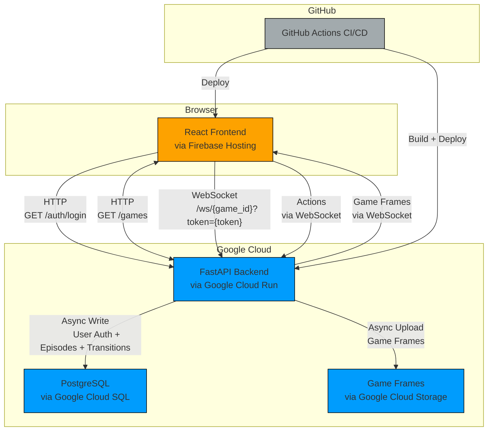
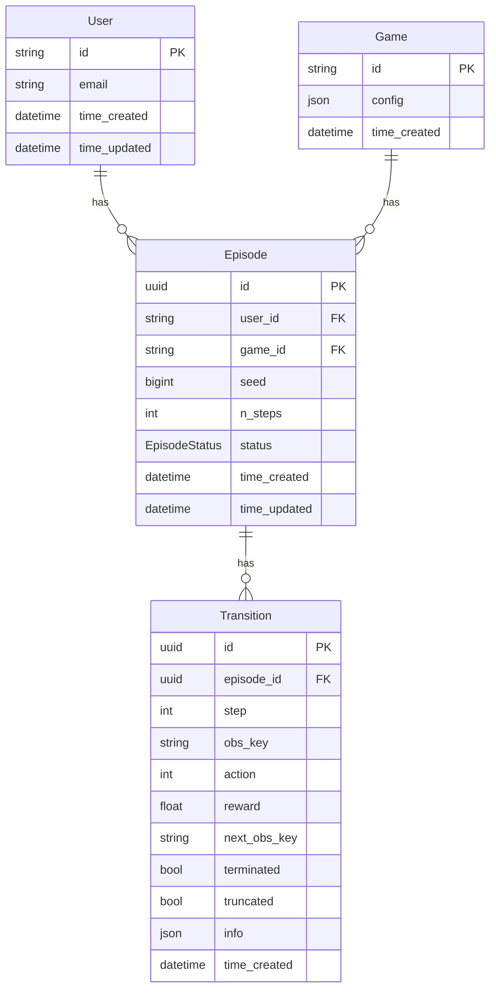

# **Skill Arcade**

Skill Arcade is a web-based platform for capturing and analysing human gameplay data from classic reinforcement learning environments. It provides a real-time, low-latency interface for researchers to collect high-quality datasets of human skill, which can be used to study skill acquisition and build more capable AI agents.

> [!IMPORTANT]  
> Data collection is currently disabled; to enable, revert changes in commit `disable: writing to cloud db`:`b7723f150d1e6d74c5f0123be9d1102aec41cdc0`

<br>
<br>
<br>

## Website Demo

https://github.com/user-attachments/assets/731d747d-4a71-43f0-9b9d-eb2c47252d8c

<br>
<br>
<br>

## **Key Features**

- **Real-Time Gameplay:** Play classic Atari and custom games in the browser with a responsive, low-latency experience powered by a WebSocket-based architecture.
- **Rich Data Collection:** Every action and observation is recorded, creating detailed episode logs that are invaluable for imitation learning and behavioural research.
- **Asynchronous Data Pipeline:** A multi-worker asynchronous queue ensures that game performance remains high by uploading observations and database entries to the cloud without blocking the game loop.
- **Extensible Game Environments:** Easily add new games by leveraging the [Gymnasium](https://gymnasium.farama.org/) interface. Includes classic Atari games and custom environments like the Tower of Hanoi.
- **Automated Cloud Deployment:** A sophisticated CI/CD pipeline using GitHub Actions automatically builds, tests, and deploys the entire stack to Google Cloud and Firebase.
- **Ephemeral Preview Environments:** Every pull request automatically spins up a fully functional, isolated preview environment for seamless review and testing.

<br>
<br>
<br>

## **Architecture Overview**

The application is a monorepo with a decoupled frontend and backend, designed for independent scaling and deployment on Google Cloud.



<br>
<br>
<br>

## **Database Schema**

The database schema is defined using SQLModel and consists of four main tables: `User`, `Game`, `Episode`, and `Transition`. The relationships between these tables are designed to efficiently store and query gameplay data.



<br>
<br>
<br>

## **Tech Stack**

- Code:
  - Backend:
    - Python via FastAPI + SQLModel
  - Frontend:
    - React via TypeScript
    - Vite
    - Tailwind CSS
- Hosting:
  - Backend:
    - Google Cloud Run
    - Google Cloud Storage
    - Google Cloud SQL (PostgreSQL)
    - Google Artifact Registry
  - Frontend:
    - Firebase Hosting

<br>
<br>
<br>

## **Getting Started**

### **Prerequisites**

- [uv](https://github.com/astral-sh/uv) for Python
- [Node.js](https://nodejs.org/en/) and [npm](https://www.npmjs.com/) for React

<br>

### **1. Clone the repository**

```bash
git clone https://github.com/farazeid/skill-arcade.git
cd skill-arcade
```

<br>

<details>
  <summary>2. Configure Backend Secrets</summary>

### **2. Configure Backend Secrets**

The backend requires credentials for Google Cloud.

#### 1. Creat Google Cloud project

```bash
gcloud projects create --name="skill-arcade"
# Use [{project-id}] as project ID (Y/n)? Y

export PROJECT_ID="{project-id}"
export GCP_REGION="europe-west2"
export GITHUB_REPO="{your-github-username}/{your-repo-name}"

gcloud billing projects link ${PROJECT_ID} --billing-account XXXXXX-XXXXXX-XXXXXX

gcloud services enable \
  iam.googleapis.com \
  iamcredentials.googleapis.com \
  sts.googleapis.com \
  artifactregistry.googleapis.com \
  run.googleapis.com \
  sqladmin.googleapis.com \
  storage.googleapis.com \
  firebase.googleapis.com
```

#### 2. IAM & Authentication

```bash
export SERVICE_ACCOUNT_NAME="github-actions-runner"

# Create the service account that GitHub Actions will use
gcloud iam service-accounts create ${SERVICE_ACCOUNT_NAME} \
  --display-name="GitHub Actions Runner SA"

export SERVICE_ACCOUNT_EMAIL="${SERVICE_ACCOUNT_NAME}@${PROJECT_ID}.iam.gserviceaccount.com"

# Grant the necessary roles to the service account
gcloud projects add-iam-policy-binding ${PROJECT_ID} \
  --member="serviceAccount:${SERVICE_ACCOUNT_EMAIL}" \
  --role="roles/run.admin" \
  --role="roles/artifactregistry.writer" \
  --role="roles/cloudsql.client" \
  --role="roles/storage.objectAdmin" \
  --role="roles/iam.serviceAccountUser"
  # Cloud Run Admin: To deploy and manage the Cloud Run service
  # Artifact Registry Writer: To push Docker images
  # Cloud SQL Client: To allow the Cloud Run service to connect to the database
  # Storage Object Admin: To read/write to the GCS bucket
  # Service Account User: To allow Cloud Run to run using this service account's identity

# Create a Workload Identity Pool
gcloud iam workload-identity-pools create "github-pool" \
  --location="global" \
  --display-name="GitHub Actions Pool"

# Create a Workload Identity Provider for your GitHub repository
gcloud iam workload-identity-pools providers create-oidc "github-provider" \
  --workload-identity-pool="github-pool" \
  --location="global" \
  --issuer-uri="https://token.actions.githubusercontent.com" \
  --attribute-condition="assertion.repository == '${GITHUB_REPO}'" \
  --attribute-mapping="google.subject=assertion.sub,attribute.actor=assertion.actor,attribute.repository=assertion.repository"

# Allow authentications from your GitHub repository to impersonate the service account
gcloud iam service-accounts add-iam-policy-binding ${SERVICE_ACCOUNT_EMAIL} \
  --role="roles/iam.workloadIdentityUser" \
  --member="principalSet://iam.googleapis.com/${POOL_ID}/attribute.repository/${GITHUB_REPO}"
```

#### 3. Google Artifact Registry

```bash
export AR_REPO_NAME="skill-arcade"

# Create a Docker repository to store your backend container images.
gcloud artifacts repositories create ${AR_REPO_NAME} \
  --repository-format="docker" \
  --location=${GCP_REGION} \
  --description="Docker repository for backend images"
```

#### 4. Google Cloud SQL

```bash
# Generate a secure password for the database user
export SQL_PASSWORD=$(openssl rand -base64 16)

echo "Generated DB Password: ${SQL_PASSWORD}" # Save this for your GitHub secret

export SQL_INSTANCE_NAME="db"

gcloud sql instances create ${SQL_INSTANCE_NAME} \
  --database-version="POSTGRES_17" \
  --region=${GCP_REGION} \
  --tier=db-perf-optimized-N-2

# Wait X minutes while instance is initialised + backed-up

export SQL_NAME="name"

gcloud sql databases create ${SQL_NAME} --instance=${SQL_INSTANCE_NAME}

export SQL_USER="user"

gcloud sql users create ${SQL_USER} \
  --instance=${SQL_INSTANCE_NAME} \
  --password="${SQL_PASSWORD}"
```

#### 5. Google Cloud Storage

```bash
export BUCKET_NAME="${PROJECT_ID}-bucket"

gcloud storage buckets create gs://${BUCKET_NAME} \
  --location=${GCP_REGION}
```

#### 6. Link Firebase to Google Cloud project

```bash
# Create a new service account specifically for Firebase deployments
gcloud iam service-accounts create firebase-deployer \
  --display-name="Firebase Deployer SA"

# Grant it Firebase Hosting Admin role
gcloud projects add-iam-policy-binding ${PROJECT_ID} \
  --member="serviceAccount:firebase-deployer@${PROJECT_ID}.iam.gserviceaccount.com" \
  --role="roles/firebasehosting.admin"

# Create and download the secret file to your current working directory
gcloud iam service-accounts keys create firebase-credentials.json \
  --iam-account="firebase-deployer@${PROJECT_ID}.iam.gserviceaccount.com"
```

#### 7. Setup Firebase via GUI

NOTE: Do NOT close your terminal used in all of the previous steps yet.

1. Link to Your Google Cloud Project

   1. Go to the Firebase Console.
   2. Click Add project.
   3. Instead of creating a new project, select your existing GCP Project ID from the dropdown list.

2. Enable Firebase Hosting

   1. Navigate to the Hosting section (under Build).
   2. Click Get started.
   3. Follow the on-screen instructions. The CLI steps can be skipped since your GitHub Action handles the deployment. The main goal here is simply to activate the Hosting service on your project.

3. Register Your Web App and Find Your Config Keys

   1. Go to your Project Settings by clicking the cog icon ⚙️ next to Project Overview.
   2. In the General tab, scroll down to the Your apps section.
   3. Click on the Web icon (</>) to create a new web app.
   4. Give your app a nickname (e.g., "skill-arcade"). You do not need to set up Firebase Hosting at this stage, as GitHub Actions handles it. You can untick that box.
   5. The Firebase SDK snippet displays all the key-value pairs you need for your GitHub secrets in the next section.

#### 8. Add Secrets to GitHub Repository

Add via `Settings > Secrets and variables > Actions`

```bash
# GCP_PROJECT_ID
echo ${PROJECT_ID}

# GCP_SERVICE_ACCOUNT
echo ${SERVICE_ACCOUNT_EMAIL}

# GCP_WORKLOAD_IDENTITY_PROVIDER
echo $(gcloud iam workload-identity-pools providers describe "github-provider" --location="global" --workload-identity-pool="github-pool" --format="value(name)")

# GCP_SQL_CONNECTION_NAME
gcloud sql instances describe ${SQL_INSTANCE_NAME} --format="value(connectionName)"

# GCP_SQL_NAME
echo ${SQL_NAME}

# GCP_SQL_PASSWORD
echo ${SQL_PASSWORD}

# GCP_SQL_USER
echo ${SQL_USER}

# GCP_BUCKET_NAME
echo ${BUCKET_NAME}

# FIREBASE_SERVICE_ACCOUNT
# Copy + paste contents of firebase-credentials.json

# FIREBASE_PROJECT_ID
echo ${PROJECT_ID}

# UPLOADER_NUM_WORKERS
# 16
```

#### 9. Add Secrets to Local Repository:

```bash
# Create `.env`s
cd website/backend && touch .env

# GCP_PROJECT_NAME="..."
# GCP_BUCKET_NAME="..."
# GCP_SQL_CONNECTION_NAME="..."
# GCP_SQL_NAME="..."
# GCP_SQL_USER="..."
# GCP_SQL_PASSWORD="..."

# UPLOADER_NUM_WORKERS="..."

cd ../..

cd website/frontend && touch .env

# VITE_PUBLIC_WEBSITE_HOSTNAME=...  # no quotation marks
```

<br>

</details>

### **3. Instantiate Database**

```bash
cd website/backend
uv sync
# cloud-sql-proxy --address 0.0.0.0 --port 1234 $GCP_SQL_CONNECTION_NAME  # in separate terminal; for Google Cloud SQL
alembic upgrade head
```

<br>

### **4. Run The Backend Server**

```bash
cd website/backend
uv sync
uv run uvicorn src.main:app --port 8080 --reload
```

The backend server will be available at http://localhost:8080.

<br>

### **5. Run The Frontend Application**

1. Open a new terminal and navigate to the frontend directory:

```bash
cd website/frontend
```

2. Install dependencies and start the development server:

```bash
npm install
npm run build; npm run dev
```

The frontend will be available at http://localhost:5173 and will connect to your local backend.

<br>
<br>
<br>

## **CI/CD Pipeline**

This project uses GitHub Actions for a fully automated deployment workflow.

- Pull Requests
- Merges to the main branch
