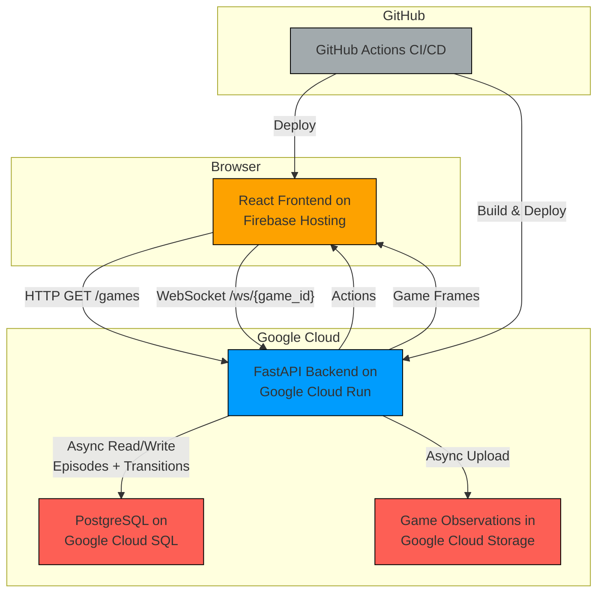

# **Skill Arcade**

Skill Arcade is a web-based platform for capturing and analysing human gameplay data from classic reinforcement learning environments. It provides a real-time, low-latency interface for researchers to collect high-quality datasets of human skill, which can be used to study skill acquisition and build more capable AI agents.

## **Key Features**

- **Real-Time Gameplay:** Play classic Atari and custom games in the browser with a responsive, low-latency experience powered by a WebSocket-based architecture.
- **Rich Data Collection:** Every action and observation is recorded, creating detailed episode logs that are invaluable for imitation learning and behavioural research.
- **Asynchronous Data Pipeline:** A multi-worker asynchronous queue ensures that game performance remains high by uploading observations and database entries to the cloud without blocking the game loop.
- **Extensible Game Environments:** Easily add new games by leveraging the [Gymnasium](https://gymnasium.farama.org/) interface. Includes classic Atari games and custom environments like the Tower of Hanoi.
- **Automated Cloud Deployment:** A sophisticated CI/CD pipeline using GitHub Actions automatically builds, tests, and deploys the entire stack to Google Cloud and Firebase.
- **Ephemeral Preview Environments:** Every pull request automatically spins up a fully functional, isolated preview environment for seamless review and testing.

## **Architecture Overview**

The application is a monorepo with a decoupled frontend and backend, designed for independent scaling and deployment on Google Cloud.



## **Tech Stack**

- Code:
  - Backend:
    - Python via FastAPI + SQLModel
  - Frontend:
    - React via TypeScript
    - Vite
    - Tailwind CSS
- Hosting:
  - Backend:
    - Google Cloud Run
    - Google Cloud Storage
    - Google Cloud SQL (PostgreSQL)
    - Google Artifact Registry
  - Frontend:
    - Firebase Hosting

## **Getting Started**

### **Prerequisites**

- [uv](https://github.com/astral-sh/uv) for Python
- [Node.js](https://nodejs.org/en/) and [npm](https://www.npmjs.com/) for React

### **1. Clone the repository**

```bash
git clone https://github.com/farazeid/skill-arcade.git
cd skill-arcade
```

### **2. Configure Backend Secrets**

The backend requires credentials for Google Cloud.

1. Navigate to the backend directory:

```bash
cd website/backend
```

2. Create a `.env` file:

```bash
touch .env
```

3. Configure secrets in the `.env` file:

```dotenv
# website/backend/.env

GCP_PROJECT_NAME="..."
GCP_BUCKET_NAME="..."
GCP_SQL_CONNECTION_NAME="..."
GCP_SQL_NAME="..."
GCP_SQL_USER="..."
GCP_SQL_PASSWORD="..."

UPLOADER_NUM_WORKERS="..."


# website/frontend/.env

VITE_FIREBASE_API_KEY="..."
VITE_FIREBASE_AUTH_DOMAIN="..."
VITE_FIREBASE_PROJECT_ID="..."
VITE_FIREBASE_STORAGE_BUCKET="..."
VITE_FIREBASE_MESSAGING_SENDER_ID="..."
VITE_FIREBASE_APP_ID="..."
VITE_FIREBASE_MEASUREMENT_ID="..."
```

Refer to this [GitHub Gist](https://gist.github.com/farazeid/065c5c2b2b0d24ba48f1c53999a48576) to setup Google Cloud services via `gcloud` CLI.

### **3. Run The Backend Server**

```bash
cd website/backend
uv sync
uv run uvicorn src.main:app --port 8080 --reload
```

The backend server will be available at http://localhost:8080.

### **4. Run The Frontend Application**

1. Open a new terminal and navigate to the frontend directory:

```bash
cd website/frontend
```

2. Install dependencies and start the development server:

```bash
npm install
npm run build; npm run dev
```

The frontend will be available at http://localhost:5173 and will connect to your local backend.

## **CI/CD Pipeline**

This project uses GitHub Actions for a fully automated deployment workflow.

- Pull Requests
- Merges to the main branch
